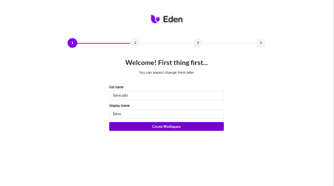
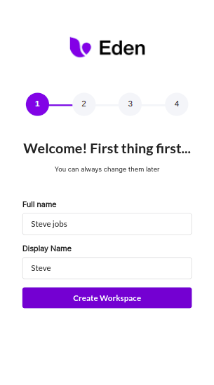
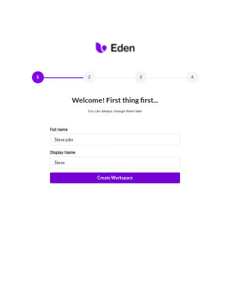

# Dribbble UI Challenge
Yo, what's up guys! 🥳

This repo contains Dribbble Ui challenge which give by [Eren](https://dribbble.com/ertuken), and challenge is [Onboarding #Exploration](https://dribbble.com/shots/15669113-Onboarding-Exploration) 🌠

# Preview
 
### Laptop



### Phone




### Tablet


# Install

Default branch is `master`. Checkout to the latest branch if `master` is not upto date.

```sh
git checkout <branch-name>
```

To install all the dependencies, run

```sh
npm install
```

To start **development** environment, run

```sh
npm run start
# or
npm start
```

Setup to start production server for the first time

```sh
sudo npm i -g serve@latest
```

To start **production** server, run the following commands

```sh
npm run build:maxspace
serve -s -l 8080 build # for specific port
# or
serve -s build #for default port, random if default is used
```

# Tech Stack used

### React with Typescript
- https://www.typescriptlang.org/docs/handbook/react.html

# Libraries used

### Sematic Ui React

- https://react.semantic-ui.com/


